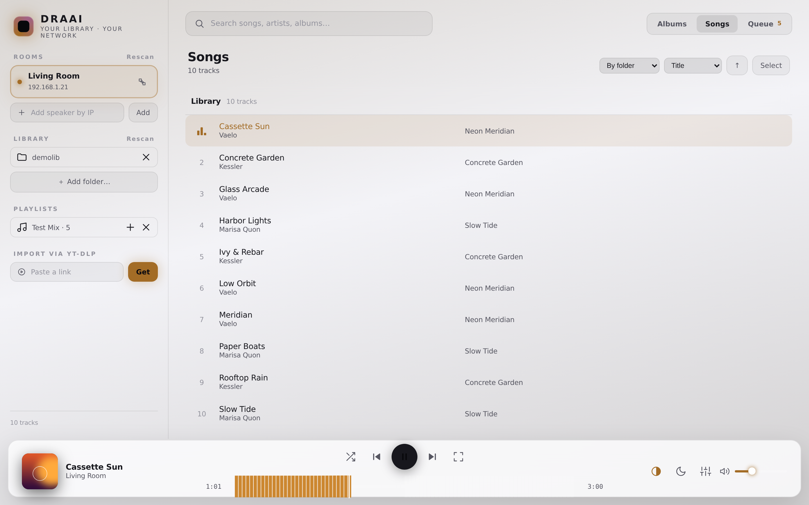

# DRAAI

**Your library. Your network. Your control.**

**Play your own music on Sonos and IKEA Symfonisk speakers — from your Mac,
with no cloud, no account, and no subscription.**

You have a folder of mp3s. You have a Sonos (or IKEA Symfonisk, which is
Sonos inside) speaker. Getting the first to play on the second should be
easy, and somehow every app that promises it is broken, paywalled, or both.
This is a tiny, dependency-free app that fixes that — pure Python standard
library, and you can even run it as one downloadable file (`draai.pyz`). It
runs on your Mac, finds your speakers on your Wi-Fi, and streams your files to
them directly — bit-perfect, at whatever quality your files are (320 kbps
mp3s, lossless FLAC, all of it).

No Sonos account. No internet needed. Nothing leaves your home network.

## What it looks like

*(Screenshot shows a demo library with generated artwork.)*



The interface is calm and consistent: one fixed accent (a soft teal),
album-art thumbnails on every row, and folder/artist groups you can
collapse. It follows your macOS light/dark setting, one click to override.
The full-screen now-playing view (the ⛶ icon in the player bar) still takes
its color from the album art, and the record icon at the top of it switches
to a spinning vinyl deck with your artwork as the label.

## Why this exists

This project was born on an ordinary evening with a folder of mp3s, an
IKEA Symfonisk speaker, and the reasonable assumption that connecting the
two would be simple. It wasn't. Every existing route turned out to be a
workaround wearing a product's clothes:

**The official way.** The Sonos app can play a "Music Library" — if you
set up SMB file sharing on your Mac, get the permissions right, let it
index your collection, and re-index when it changes. A network-drive
ritual from another era, for playing a file that's sitting right there.

**The App Store apps.** A parade of third-party players that are broken,
abandoned, paywalled behind subscriptions, or quietly upload your music to
their cloud so they can stream it back to you. None of them just played
the folder.

**The mirroring apps.** These capture your Mac's entire audio output and
re-stream it with a delay — every notification ding included, seeking
broken, quality reduced. A screwdriver used as a hammer.

**The media servers.** Plex, Jellyfin, Logitech Media Server — genuinely
good software that answers a different question. Standing up a media
server with libraries, users, and transcoders to play mp3s on the speaker
three meters away is a lot of ceremony for a small wish.

The absurd part: Sonos speakers natively do exactly what's needed. You
hand them the address of an audio file on your network, and they play it
— that capability has been sitting in every unit all along. DRAAI is just
the missing polite conversation with your speaker: a small engine that
serves your files and asks the speaker to play them. No accounts, no
indexing, no cloud, no subscription. The way it arguably should have
worked out of the box.

## Quick start

1. Click the green **Code** button → **Download ZIP**, and unpack it
   (or `git clone https://github.com/itsmesaskovic/draai.git`).
2. Open **Terminal** (press Cmd+Space, type "Terminal", press Enter).
3. Go into the folder and start it:

   ```
   cd ~/Downloads/draai-main   # or wherever you unpacked it
   python3 -m draai
   ```

   Prefer a single file? Download **`draai.pyz`** from the latest release
   and just run `python3 draai.pyz` from anywhere — no unzipping, still no
   install and no dependencies.

### What happens next

- The Terminal prints a short banner and keeps running — that's the engine;
  leave it open. Your browser opens the control panel at
  http://localhost:8765.
- Your speakers appear under **Rooms** within a few seconds (first time on a
  new network can take a moment — there's a Rescan button).
- Under **Library**, click **＋ Add folder…** and pick your music folder.
  Your songs appear instantly; albums with embedded artwork get covers.
- Click a song and it plays on the speaker. Click the ⛶ icon in the player
  bar for the full-screen now-playing view — that view takes on the album's
  colors, and the record icon at its top switches to the vinyl deck.

Two things may happen on first run, both normal and both one-time:

- If your Mac has never used Python, macOS offers to install its developer
  tools. Click **Install** and wait a few minutes, then run the command again.
- macOS asks whether Python may **accept incoming network connections**.
  Click **Allow** — that's how the speakers fetch the music from your Mac.

Keep the Terminal window open while music plays (your Mac is the music
server). Press Ctrl+C in that window to quit.

## Not technical? Let your AI walk you through it

You don't need a GitHub account for any of this — the green **Code** button
→ **Download ZIP** works for everyone. And if the steps above feel foreign,
copy the block below and paste it into your AI assistant (Claude, ChatGPT,
Copilot — any of them). It will guide you through setup one step at a time:

```text
I want to set up DRAAI, a free open-source app that plays my own music
files on my Sonos / IKEA Symfonisk speakers, from this page:
https://github.com/itsmesaskovic/draai

I'm on a Mac and not very technical. Please walk me through it ONE step
at a time, waiting for me to confirm each step worked before the next.

The steps: (1) download the ZIP from the GitHub page (green "Code"
button, no account needed) and unzip it; (2) open Terminal, cd into the
unzipped folder (usually ~/Downloads/draai-main) and run:
python3 -m draai
(3) if macOS offers to install "command line developer tools", I should
accept and wait, then run the command again; (4) if macOS asks whether
Python may accept incoming network connections, I click Allow; (5) a
control panel opens in my browser — help me pick my speaker under Rooms
and add my music folder under Library; (6) if no speakers appear, check
I'm on the same Wi-Fi as the speakers, press Rescan, or add the speaker
by its IP address (shown in the Sonos app under Settings > System >
About My System); (7) only if I want extras: "brew install ffmpeg"
enables the waveform visuals, and "python3 -m draai --install-autostart" makes it start automatically at login.

If anything fails, ask me to paste the exact Terminal output and help me
fix it before moving on.
```

## Features

- Finds Sonos / Symfonisk speakers automatically (or add one by IP address)
- A queue you can actually manage: drag to reorder, **Play next**, add whole
  albums or folders, multi-select songs (Cmd/Shift-click, or the Select button)
- Playlists saved as plain `.m3u` files in your music folder — no database,
  no cloud, readable by any player
- Light & dark theme — follows macOS automatically, one click to override
- Songs view can group by folder or artist, sort by title/artist/date added;
  folder headers show the full path on hover and open in Finder
- Long sets resume where you left off, even after restarting
- Vinyl deck view: a spinning record with your artwork as the label
- Media keys: play/pause from your keyboard, artwork in macOS now-playing
- Library from one or many folders — add them with a built-in folder picker,
  no path-typing needed
- Library with search, real metadata from your files' tags, embedded album art
- Play, pause, skip, seek bar, shuffle, volume
- Queue: add songs, jump around, remove, clear
- Multi-room: group speakers to play in sync, per-room volume
- Real speaker EQ (bass / treble / loudness on the speaker itself)
- Sleep timer
- Guest mode: a QR code lets anyone on your Wi-Fi queue songs from their phone
- Supports mp3, m4a/aac, flac, wav, aiff, ogg — streamed untouched, so
  lossless files play lossless

## Optional extras

Some features use [ffmpeg](https://ffmpeg.org). Install it once with
[Homebrew](https://brew.sh):

```
brew install ffmpeg
```

This enables the waveform / audio-analysis visuals.
Without it, the app works fine — those visuals simply stay off.

### Start at login (optional)

To have DRAAI always running in the background — no Terminal window:

```
python3 -m draai --install-autostart
```

Then just open http://localhost:8765 whenever you want music.
Undo anytime with `--uninstall-autostart`.

### yt-dlp integration (optional, read this)

[yt-dlp](https://github.com/yt-dlp/yt-dlp) is a separate, widely used
open-source media downloader. This project does not include, bundle, or
download it — but if you have installed it yourself
(`brew install yt-dlp ffmpeg`), the app shows an import box: paste a link,
and yt-dlp saves the audio — with title, artist and cover art embedded —
into an `Imported` subfolder of your first library folder
(e.g. `~/Music/Imported/`). The library rescans automatically.

**Use this only for content you have the right to download**: your own
uploads, Creative Commons-licensed material, public-domain recordings, and
content whose owner permits it. Downloading may otherwise violate a
website's terms of service and/or copyright law in your country. The
authors of this project do not endorse or encourage downloading copyrighted
content, and how you use your own yt-dlp installation is your responsibility
alone.

## The interface

The player is two parts: an engine (the `draai` package, run with `python3 -m
draai` or the single-file `draai.pyz`) and an interface. A basic interface is
built in, but DRAAI ships **the full interface** (`player_ui.html`) — a far
nicer one, with a synced visualizer, a full-screen mode, and guest access —
bundled inside the package. To tweak it live, drop your own `player_ui.html`
in the folder you run DRAAI from and it overrides the built-in one.

Want to build your own? The engine exposes a simple JSON API (`/api/...`) —
see the source — so anyone can design a front end without touching the
engine.

## Contributing

The engine is the `draai/` package — pure Python standard library, no pip
dependencies, ever. Keep the import graph clean (`state`/`constants` are
leaves; `server`/`__main__` are the roots) and run `python3 build.py` to
bundle it — package plus web UI — into the single distributable `draai.pyz`.
The test suite needs no speakers, network, or ffmpeg:

```
python3 tests/test_draai.py
```

## Troubleshooting

- **"No speakers found"** — Your Mac must be on the same Wi-Fi network as the
  speakers. Some routers block device discovery between devices; use *add by
  IP address* (find speaker IPs in the Sonos app under Settings → System →
  About My System).
- **Music stops when I close the laptop** — The speakers stream from your
  Mac, so the app must be running while music plays.
- **The song plays but shows no title/art** — That file has no embedded tags
  or artwork. Tag your files with any tagging tool and rescan.
- **Something else** — Open an issue in this repository.

## Fine print

This is an unofficial, independent project. It is not affiliated with,
endorsed by, or connected to Sonos Inc., Inter IKEA Systems B.V., Google LLC,
or YouTube. All trademarks belong to their respective owners. The software
controls speakers you own, on your own network, using their local network
interface, and is provided **"as is", without warranty of any kind** — see
[LICENSE](LICENSE).

## License

[MIT](LICENSE) — free to use, copy, modify, and share.
